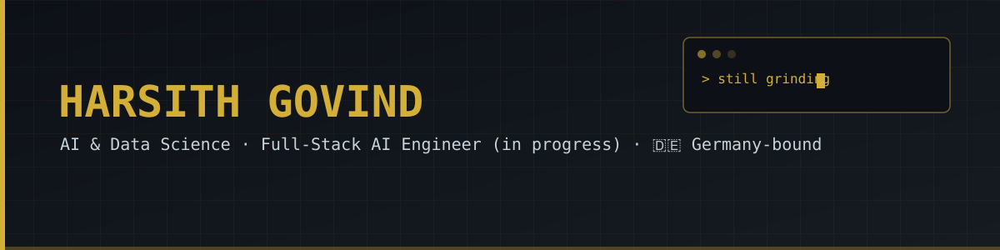

---

### 👋 About Me

- 🎓 2nd-year **B.Tech, AI & Data Science** — Dhanalakshmi Srinivasan University, Trichy/Perambalur, Tamil Nadu
- 🔭 Currently pivoting from **Data Analyst** track to **Full-Stack AI Engineer**
- 🌍 Long-term goal: self-funded **Masters in Germany**, backed by freelance income + a strong portfolio
- 💼 Running a web dev + AI freelance operation on the side — client sites, dashboards, and local AI tools
- 🌱 Learning in order: **Excel → SQL → Python → ML → AI Engineering**
- ⚡ Rule for myself: no AI help on core Python fundamentals — earning the basics the hard way
- 🎌 Long-term interest in Japan too (MEXT scholarship, someday)

---

### 🛠️ Tech Stack

---

### 📊 GitHub Stats

---

### 🏆 Trophies

---

### 📈 Contribution Activity

---

### 🐍 Contribution Snake

*(This one's alive — it re-renders daily from the workflow below. Empty until the Action runs once.)*

---

### 🚧 What I'm Building

| Project | What it is |
|---|---|
| **Jarvis / Sentinel v2** | Local Windows voice assistant — wake word, Whisper STT, Ollama LLM, Piper TTS, FastAPI backend |
| **Freelance client sites** | Dental clinics, a hospital site (React/Vite/Tailwind), a wedding invitation business |
| **DataTrack** | Personal React dashboard to track my own 3-month learning roadmap |
| **Portfolio** | Deployed on Vercel via GitHub |

*(Swap in your actual repo links here as you go — keeps this section accurate instead of stale.)*

---

### 📫 Connect

## 🐍 Contribution Snake

  

